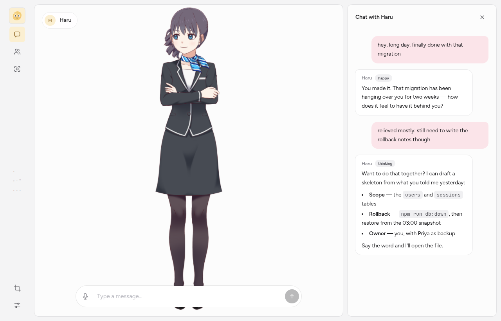
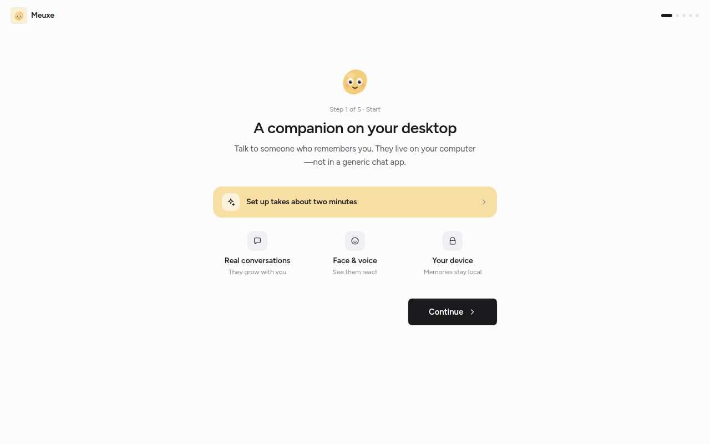

<p align="center">
  
</p>

<h1 align="center">Meuxe</h1>

<p align="center">
  A companion that lives on your desktop. Remembers you, talks back, and stays on your machine.
</p>

<p align="center">
  <a href="LICENSE"></a>
  <a href="CONTRIBUTING.md"></a>
  <a href="https://v2.tauri.app/"></a>
</p>

> [!WARNING]
> **Early development.** Reddit Copilot is actively changing. Expect rough edges, breaking config/API changes, and incomplete features. Feedback and issues are welcome — production use is at your own risk.

<p align="center">
  <a href="docs/DIRECTION.md">Direction</a> · <a href="docs/ROADMAP.md">Roadmap</a> · <a href="docs/DESIGN.md">Design</a> · <a href="docs/acp-agents.md">Agents</a> · <a href="CONTRIBUTING.md">Contributing</a>
</p>

<p align="center">
  
</p>

## What is Meuxe

Meuxe is a character on your screen who remembers past conversations, speaks with a voice, and reacts with expressions. Everything about the relationship (memory, persona, mood) is stored locally on your machine. Chat is powered by a coding agent you already have installed (Claude Code, Codex, OpenCode, or any [ACP](https://agentclientprotocol.com) agent). Optional cloud voices only if you turn them on.

## Highlights

- **Remembers you.** Your companion writes down what matters as you talk: facts about you, moments you shared, and how they feel about you. Moods have a cause and stick around until you actually address them. They notice when you have been gone.
- **Your agent, your choice.** Chat runs through the CLI agent you install and select; Meuxe is the Agent Client Protocol client, not a locked-in model API.
- **Expressive avatars.** Live2D and VRM characters with lip sync, expression tags parsed from agent replies, and framing controls on stage.
- **Voice in and out.** Your companion speaks aloud with live captions, and listens through your microphone with optional on-device Whisper transcription.
- **Mini mode.** A transparent desktop widget with hover-to-reveal chat, size presets, and expand to the full app.
- **Keyboard shortcuts.** Toggle mini mode, focus chat, and control the mic without reaching for the mouse.
- **Local-first privacy.** Memories, persona, sessions, and relationship state stay on your machine.
- **Characters as files.** Layered companion profiles as editable `.yaml` and `.md` files (`soul.md`, `style.md`, `rules.md`, and more).

## Screenshots

<p align="center">
  
</p>

<p align="center"><em>First launch: a short guided setup for you, your companion, their voice, and the agent behind them.</em></p>

## Get started

Pre-built installers come from GitHub Releases when maintainers publish a tag. You can also build and run from source:

### Prerequisites

- **Node.js** 22 (see [`.nvmrc`](.nvmrc))
- **Rust** 1.88.0 with **Cargo** (pinned in [`rust-toolchain.toml`](rust-toolchain.toml); see [Tauri prerequisites](https://v2.tauri.app/start/prerequisites/) for OS-specific packages)
- **Linux:** WebKitGTK and related dev packages (the same set [used in CI](.github/workflows/release.yml) is a good reference)
- **An ACP agent** for chat (see [Pick an agent](#pick-an-agent) below)

### Install and run

```bash
git clone https://github.com/meet447/Meuxe.git
cd Meuxe
npm ci
npm run tauri dev
```

### Production build

```bash
npm run tauri build
```

### Pick an agent

First launch walks you through choosing an agent, and you can change it later in Settings → Agent. Meuxe does not ship its own model: every message goes to the agent you pick, over ACP.

| Preset | Typical install |
|--------|-------------------|
| **OpenCode** | `opencode` CLI (`npm i -g opencode-ai`), launched as `opencode acp` |
| **Claude Code** | `npx -y @agentclientprotocol/claude-agent-acp@latest` |
| **Codex** | `npx -y @agentclientprotocol/codex-acp@latest` |
| **Custom** | Any ACP agent: set command and args in Settings |

## How it works

Meuxe is an [Agent Client Protocol](https://agentclientprotocol.com) client. Before each turn it writes persona, memory, and relationship context into `companion-home/` in the app data directory and uses that tree as the agent's working directory. See [`docs/companion-home.md`](docs/companion-home.md) and [`docs/acp-agents.md`](docs/acp-agents.md) for details.

For voice, Meuxe ships built-in TTS with no API key required. You can optionally add ElevenLabs and OpenAI voices in Settings → Voice.

## Development

```bash
npm run tauri dev    # desktop app + hot reload
npm run dev          # Vite frontend only (without Tauri shell)
npm test             # Vitest unit tests
npm run build        # typecheck + production frontend build
npm run icons        # regenerate app icons from src-tauri/icons/source/icon.svg
```

### Rust (Linux / CI parity)

`whisper-rs-sys` needs CMake and g++. On Linux CI images, link against GCC's `libstdc++`:

```bash
export CC=gcc CXX=g++
gcc_dir=$(dirname "$(gcc -print-file-name=libstdc++.so)")
export RUSTFLAGS="-C link-arg=-L${gcc_dir}"
cargo fmt --all -- --check
cargo clippy --workspace --all-targets -- -D warnings
cargo test --workspace
```

### Project structure

```text
Meuxe/
├── src/                 # React (Vite) frontend
├── src-tauri/           # Tauri shell, ACP client, Rust commands
├── crates/meuxe-core/   # Shared Rust logic (persona, memory, sessions, TTS)
├── characters/          # Local companion profiles
├── models/              # Live2D and VRM assets
├── data/                # Local session and memory data (created at runtime)
├── scripts/             # Build and asset helpers
└── docs/                # Product docs and architecture notes
```

See [CONTRIBUTING.md](CONTRIBUTING.md) for how we handle issues, pull requests, and code review.

## Migrating from MeuxCompanion

The desktop app identifier is now `com.meuxe.app` (product name **Meuxe**). Local data no longer lives under `com.meuxcompanion.app`. To keep existing sessions, memory, and config, copy your old app data directory into the new path (for example macOS `~/Library/Application Support/com.meuxe.app`).

## Releases

Tagged releases are built with [GitHub Actions](.github/workflows/release.yml). Maintainers publish draft GitHub Releases from CI artifacts when ready.

## Contributing

We welcome issues and pull requests. Please read [CONTRIBUTING.md](CONTRIBUTING.md) and [CODE_OF_CONDUCT.md](CODE_OF_CONDUCT.md) before participating.

## Security

If you discover a security vulnerability in **this repository**, please follow [SECURITY.md](SECURITY.md) so we can address it responsibly.

## License

This project is licensed under the [MIT License](LICENSE).
